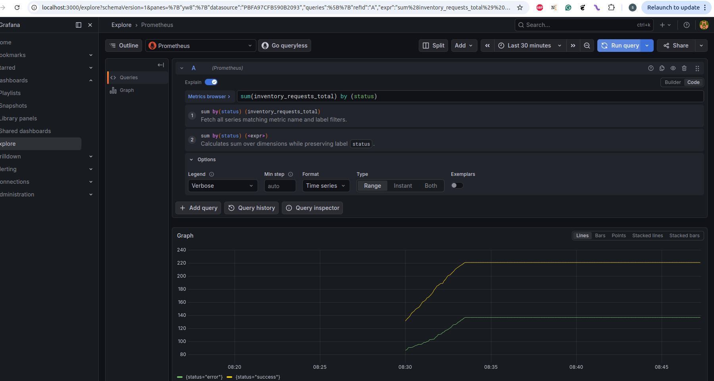
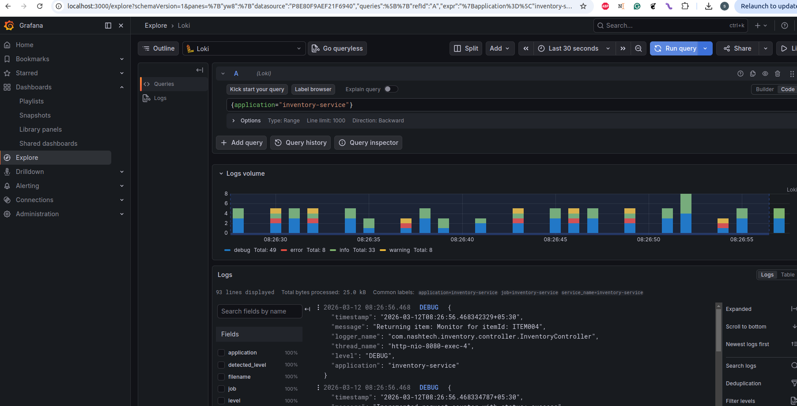
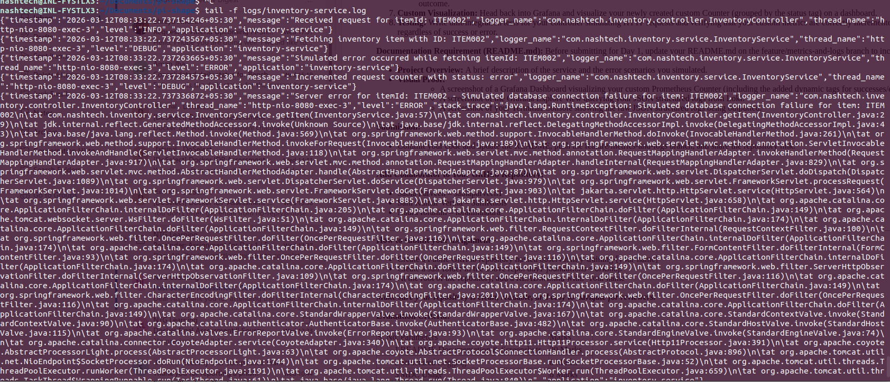

# Inventory Service - Observability Exercise

## Project Overview

This is an observable Spring Boot application that implements a simple Inventory REST API with comprehensive observability features. The service demonstrates modern monitoring practices using Prometheus for metrics, Loki for log aggregation, and Grafana for visualization.

### Key Features

- **REST API**: GET endpoint to retrieve inventory items by ID
- **Structured Logging**: JSON-formatted logs using Logstash Logback Encoder
- **Metrics Collection**: Custom and JVM metrics exposed via Prometheus
- **Error Simulation**: Realistic error scenarios for observability testing
- **Complete Observability Stack**: Prometheus, Loki, Promtail, and Grafana

### Simulated Scenarios

The application simulates realistic production scenarios:

1. **Random Processing Delays** (20% probability)
   - Simulates network latency or slow database queries
   - Random delay between 500ms and 2500ms
   - Helps demonstrate latency tracking in metrics

2. **Simulated Database Failures** (15% probability)
   - Throws `RuntimeException` to simulate connection failures
   - Returns HTTP 500 status code
   - Increments error counter metric

3. **Item Not Found Scenarios**
   - Returns HTTP 404 for invalid item IDs
   - Logs warning messages
   - Increments error counter metric

## Architecture

```
┌─────────────┐      ┌──────────────┐      ┌───────────┐
│   Client    │─────>│ Spring Boot  │─────>│Prometheus │
│             │      │  (Port 8080) │      │(Port 9090)│
└─────────────┘      └──────────────┘      └───────────┘
                            │                      │
                            │ JSON Logs            │ Metrics
                            ▼                      ▼
                     ┌──────────┐           ┌──────────┐
                     │  Loki    │           │ Grafana  │
                     │(Port 3100)│<─────────│(Port 3000)│
                     └──────────┘           └──────────┘
                            ▲
                            │
                     ┌──────────┐
                     │ Promtail │
                     └──────────┘
```

## Prerequisites

- Java 17 or higher
- Maven 3.6+
- Docker and Docker Compose
- Git

## Getting Started

### 1. Build the Application

```bash
mvn clean package
```

### 2. Run Tests

```bash
mvn test
```

All tests should pass, including:
- Controller unit tests
- Service layer tests
- Metrics verification tests

### 3. Start the Observability Stack

```bash
docker-compose up -d
```

This starts:
- **Prometheus** on http://localhost:9090
- **Loki** on http://localhost:3100
- **Grafana** on http://localhost:3000 (admin/admin)
- **Promtail** for log collection

### 4. Run the Application

```bash
mvn spring-boot:run
```

The application will start on http://localhost:8080

### 5. Generate Traffic

Test the API with various scenarios:

```bash
# Successful request
curl http://localhost:8080/api/inventory/items/ITEM001

# Item not found (404 error)
curl http://localhost:8080/api/inventory/items/INVALID

# Health check
curl http://localhost:8080/api/inventory/health

# Generate multiple requests (some will fail randomly)
for i in {1..50}; do curl http://localhost:8080/api/inventory/items/ITEM00$((RANDOM % 5 + 1)); sleep 0.5; done
```

## Observability Endpoints

### Actuator Endpoints

- **Health**: http://localhost:8080/actuator/health
- **Metrics**: http://localhost:8080/actuator/metrics
- **Prometheus**: http://localhost:8080/actuator/prometheus

### Available Items

The inventory contains 5 pre-configured items:
- `ITEM001` - Laptop ($999.99)
- `ITEM002` - Mouse ($29.99)
- `ITEM003` - Keyboard ($79.99)
- `ITEM004` - Monitor ($299.99)
- `ITEM005` - Headphones ($149.99)

## Custom Metrics

### inventory.requests.total

A custom Counter metric tracking all requests with dynamic tags:

- **Tag**: `status`
  - `success`: Successful item retrieval
  - `error`: Failed requests (not found or server error)

**PromQL Queries:**

```promql
# Total requests by status
sum(inventory_requests_total) by (status)

# Request rate (requests per second)
rate(inventory_requests_total[1m])

# Success vs Error ratio
sum(inventory_requests_total{status="success"}) / sum(inventory_requests_total)
```

## Structured Logging

The application outputs JSON-structured logs to stdout with the following fields:

```json
{
  "timestamp": "2024-01-15T10:30:45.123Z",
  "level": "INFO",
  "logger_name": "com.nashtech.inventory.service.InventoryService",
  "message": "Successfully retrieved item: Laptop with quantity: 50",
  "application": "inventory-service"
}
```

## Grafana Dashboards

### Access Grafana

1. Open http://localhost:3000
2. Login with `admin` / `admin`
3. Navigate to **Explore** or **Dashboards**

### Viewing Logs (Loki)

1. Select **Loki** as the data source
2. Use LogQL queries:

```logql
# All logs from inventory service
{application="inventory-service"}

# Error logs only
{application="inventory-service"} |= "ERROR"

# Logs with specific item ID
{application="inventory-service"} |= "ITEM001"
```

### Viewing Metrics (Prometheus)

1. Select **Prometheus** as the data source
2. Query custom metrics:

```promql
# Custom counter by status
inventory_requests_total

# JVM memory usage
jvm_memory_used_bytes

# HTTP request duration
http_server_requests_seconds_sum
```

## Visual Proof

### 1. Custom Prometheus Counter in Grafana



*Screenshot showing the `inventory_requests_total` counter grouped by status tag (success/error)*

### 2. Grafana Explore - Loki Logs



*Screenshot showing JSON structured logs queried from Loki in Grafana Explore view*

### 3. Terminal JSON Logs



*Screenshot of terminal showing raw JSON structured logs output by the application*

## Testing Strategy

### Unit Tests

- **InventoryControllerTest**: Verifies HTTP endpoints return correct status codes
- **InventoryServiceTest**: Tests business logic and metrics incrementation

### Key Test Cases

1. Successful item retrieval returns 200 OK
2. Invalid item ID returns 404 Not Found
3. Simulated errors return 500 Internal Server Error
4. Success counter increments on successful requests
5. Error counter increments on failed requests
6. Multiple requests increment counters correctly

Run tests with coverage:

```bash
mvn test jacoco:report
```

## Project Structure

```
inventory-service/
├── src/
│   ├── main/
│   │   ├── java/com/nashtech/inventory/
│   │   │   ├── InventoryServiceApplication.java
│   │   │   ├── controller/
│   │   │   │   └── InventoryController.java
│   │   │   ├── service/
│   │   │   │   └── InventoryService.java
│   │   │   └── model/
│   │   │       └── InventoryItem.java
│   │   └── resources/
│   │       ├── application.properties
│   │       └── logback-spring.xml
│   └── test/
│       └── java/com/nashtech/inventory/
│           ├── controller/
│           │   └── InventoryControllerTest.java
│           └── service/
│               └── InventoryServiceTest.java
├── docker-compose.yml
├── prometheus.yml
├── promtail-config.yml
├── grafana/
│   └── provisioning/
│       └── datasources/
│           └── datasources.yml
├── pom.xml
└── README.md
```

## Technologies Used

- **Spring Boot 3.2.2** - Application framework
- **Spring Boot Actuator** - Production-ready features
- **Micrometer** - Metrics facade
- **Prometheus** - Metrics collection and storage
- **Loki** - Log aggregation
- **Promtail** - Log shipper
- **Grafana** - Visualization and dashboards
- **Logstash Logback Encoder** - JSON structured logging
- **JUnit 5** - Testing framework
- **MockMvc** - REST API testing

## Troubleshooting

### Application won't start

```bash
# Check if port 8080 is already in use
lsof -i :8080

# Kill the process if needed
kill -9 <PID>
```

### Prometheus not scraping metrics

1. Verify application is running: `curl http://localhost:8080/actuator/prometheus`
2. Check Prometheus targets: http://localhost:9090/targets
3. Ensure `host.docker.internal` resolves (add to `/etc/hosts` if needed)

### Logs not appearing in Loki

1. Check Promtail is running: `docker logs promtail`
2. Verify log file location in `promtail-config.yml`
3. Check Loki API: `curl http://localhost:3100/ready`
